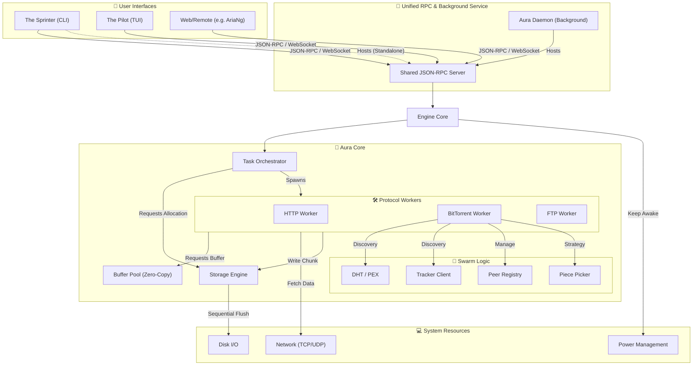
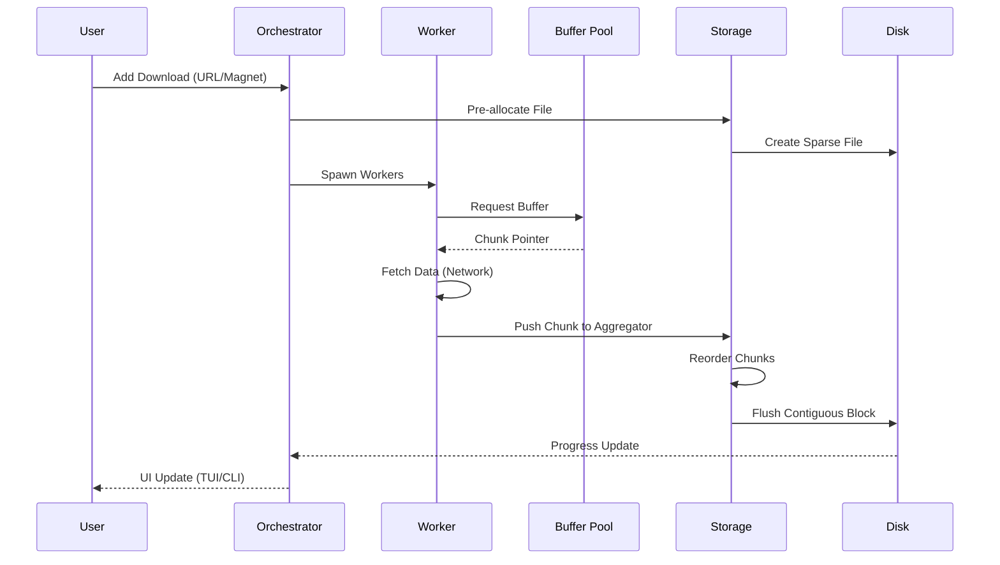
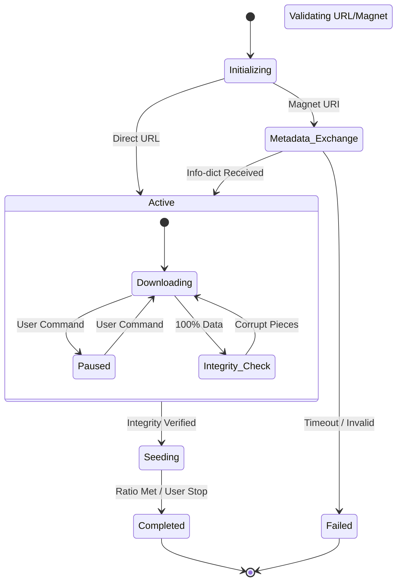
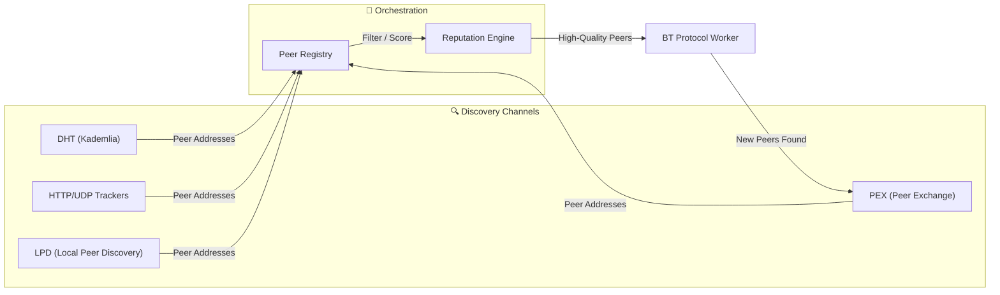
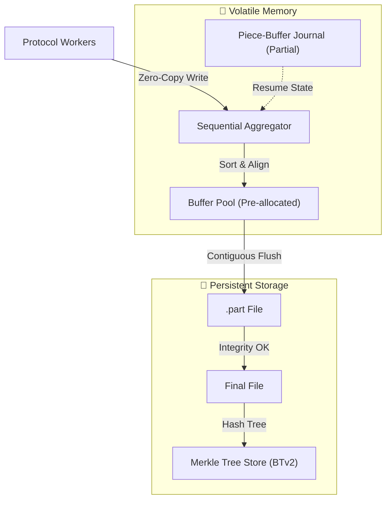
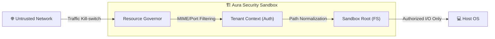

# Aura Architectural Map 🌌

This document provides a high-level overview of the Aura architecture using Mermaid diagrams to visualize component interactions and data flow.

## 🏛️ System Overview

Aura is built on a decoupled, actor-based architecture where protocol-specific logic is isolated from the core orchestration and storage engines.

## 🧩 Component Definitions

### 1. User Interfaces (Personas)
- **Aura CLI**: High-speed, one-off download tool. It can operate as a standalone instance (spinning up its own core and RPC server) or act as a client connecting to an existing `aura-daemon`.
- **Aura TUI**: Interactive dashboard for real-time monitoring and task control via JSON-RPC.
- **Aura Daemon**: The background service that persists across sessions, running the core engine and exposing the shared RPC interface.

### 2. The Engine & Orchestrator
- **Engine**: The top-level coordinator. It manages the global state, configuration, and the lifecycle of the daemon.
- **Orchestrator**: Responsible for a specific task's lifecycle. It spawns protocol workers, manages retries, and coordinates between the swarm and storage.

### 3. Storage & Memory
- **Storage Engine**: Handles all disk operations. It uses a **Sequential Aggregator** to reorder out-of-order network chunks into contiguous disk writes, minimizing head movement on HDDs and wear on SSDs.
- **Buffer Pool**: A centralized memory management system that uses pre-allocated `Bytes` chunks to ensure **zero-copy** data transfer from the network to the storage engine.

### 4. Protocol Workers
- **HTTP/FTP**: Handles mirror racing and multi-segmented downloads.
- **BitTorrent**: Manages the complex swarm logic, including:
    - **Piece Picker**: Rare-first and endgame mode strategies.
    - **Peer Registry**: Maintains health and reputation scores for connected peers.
    - **DHT/Tracker**: Handles decentralized and centralized peer discovery.

### 5. System Integration
- **NAT Traversal**: Automatic port mapping via UPnP/NAT-PMP.
- **Power Management**: Prevents the OS from entering sleep mode while active downloads are in progress.
- **VPN Kill-switch**: Ensures traffic only flows through authorized network interfaces.

## 🔄 Core Data Flow (Download)

## 🔄 Task Lifecycle (State Machine)

Aura tasks are phase-aware actors that transition through various maturation levels.

## 🐝 BitTorrent Swarm Discovery

The discovery process is a multi-channel orchestration to maximize peer density.

## 💾 Storage Engine Internals

The storage engine optimizes for high-throughput sequential I/O to protect hardware health.

## 🛡️ Security & Isolation

Aura enforces strict boundaries between the network and the host system.

## 🗺️ Implementation Map

This table maps architectural concepts to their primary implementation files in the Aura workspace.

| Component | Category | File Path |
| :--- | :--- | :--- |
| **Persona Switcher** | Orchestration | `aura/src/main.rs` |
| **The Pilot (TUI)** | Interface | `aura-tui/src/app.rs`, `ui.rs` |
| **Aura Daemon** | Persistent | `aura-daemon/src/lib.rs` |
| **Engine Core** | Orchestration | `aura-core/src/orchestrator/engine.rs` |
| **Task Orchestrator** | Orchestration | `aura-core/src/orchestrator/logic.rs` |
| **Sequential Aggregator** | Storage | `aura-core/src/storage/logic.rs` |
| **Storage Ops** | Storage | `aura-core/src/storage/ops.rs` |
| **Buffer Pool** | Memory | `aura-core/src/buffer_pool/logic.rs` |
| **HTTP Worker** | Protocol | `aura-core/src/worker/http/mod.rs` |
| **FTP Worker** | Protocol | `aura-core/src/worker/ftp.rs` |
| **BitTorrent Logic** | Protocol | `aura-core/src/worker/bittorrent/worker.rs` |
| **Piece Picker** | Strategy | `aura-core/src/piece_picker/logic.rs` |
| **Peer Registry** | Strategy | `aura-core/src/peer_registry/logic.rs` |
| **DHT Node** | Discovery | `aura-core/src/dht/actor/mod.rs` |
| **Tracker Client** | Discovery | `aura-core/src/tracker/logic.rs` |
| **Power Manager** | System | `aura-core/src/power/logic.rs` |
| **NAT Traversal** | Network | `aura-core/src/nat/logic.rs` |
| **LPD** | Discovery | `aura-core/src/lpd/logic.rs` |

---

> **Note**: This map is current as of Milestone 6. As the project matures, new mappings will be added for Merkle Tree stores and End-game mode logic. See the [ROADMAP.md](ROADMAP.md) for full status.

