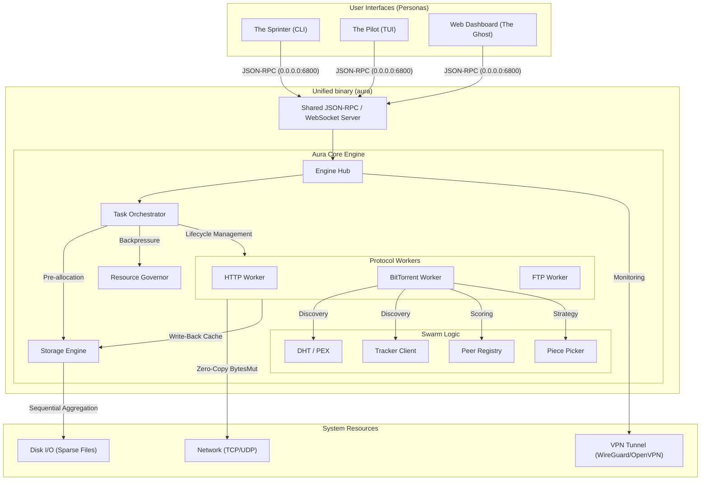
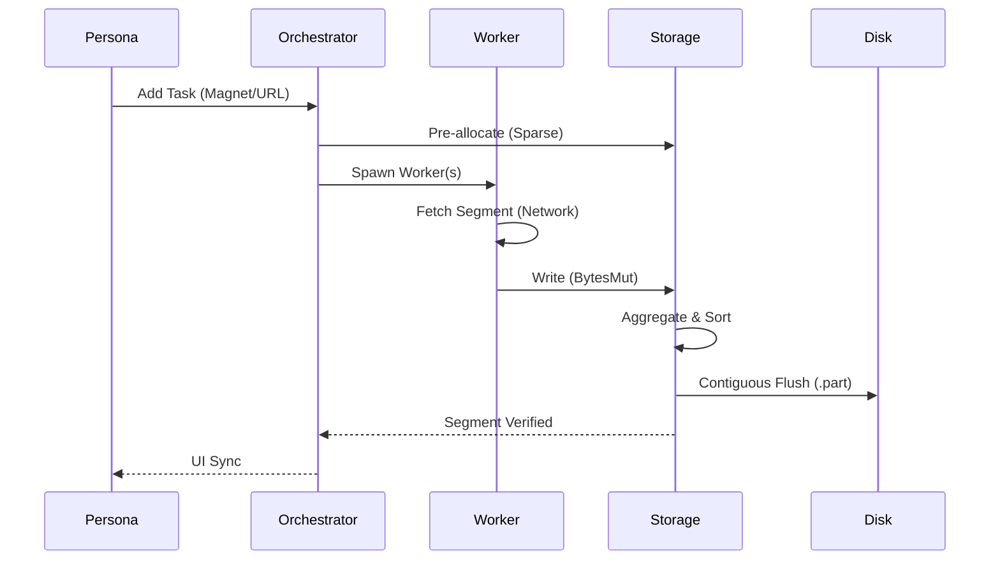

# Aura Architectural Map
This document provides a high-level overview of the Aura architecture using Mermaid diagrams to visualize component interactions and data flow.
## System Overview
Aura is built on a decoupled, actor-based architecture where protocol-specific logic is isolated from the core orchestration and storage engines. It follows the **Orchestrated Pull Model** (ADR-0001) for work assignment.

## Component Definitions
### 1. User Interfaces (Personas)
- **Aura CLI ("The Sprinter")**: Optimized for one-off tasks and shell pipelines. It can operate in "Standalone Mode" (booting an ephemeral core) or "Client Mode" (connecting to a local/remote daemon).
- **Aura TUI ("The Pilot")**: An interactive terminal dashboard following the **Stateful View Pattern**. It provides real-time visualization of swarm health, piece distribution, and historical throughput via Braille sparklines.
- **Aura Web ("The Ghost")**: A lightweight, integrated dashboard for headless servers, accessible via standard browsers.
### 2. The Engine & Orchestrator
- **Engine Hub**: The global coordinator for state, configuration, and shared services (Telemetry, Event Bus).
- **Task Orchestrator**: Manages the maturation of tasks (ADR-0008). It spans the lifecycle from URI detection to metadata exchange (BitTorrent info-dicts) and final assembly.
- **Resource Governor**: Implements global memory backpressure and CPU prioritization (ADR-0057), ensuring the daemon remains stable during massive protocol aggregation.
- **Protocol Detector**: A centralized gateway for parsing URIs and expanding local file globs (ADR-0015).
### 3. Storage & Memory
- **Sequential Aggregator**: Reorders random network chunks into contiguous disk flushes (ADR-0033), protecting hardware longevity.
- **Atomic Completion**: Utilizes `.part` files and transactional renames to ensure no corrupt or partial data is ever exposed as finished (ADR-0003).
- **Zero-Copy Pipeline**: Leverages `BytesMut` reference counting to move data from the network card to the filesystem buffer without intermediate copies.
### 4. Protocol Workers
- **HTTP/FTP**: Implements **Racing Work Stealing** (ADR-0005) across multiple mirrors to maximize bandwidth utilization.
- **BitTorrent**: A fully-featured swarm engine supporting **BitTorrent v2** (Merkle Trees), PEX, DHT, and an advanced **Endgame Mode** (ADR-0039).
### 5. System Integration
- **VPN Kill-switch**: A native monitoring loop for WireGuard and OpenVPN interfaces (ADR-0038), halting all traffic if the secure tunnel drops.
- **Happy Eyeballs**: Dual-stack racing (IPv4/IPv6) for resilient connectivity (ADR-0026).
- **Docker Hardening**: Multi-stage builds and non-root confinement for secure containerized deployment (ADR-0051).
## Core Data Flow (The Green Path)

## Implementation Map
This table maps architectural concepts to the verified codebase paths as identified by the Knowledge Graph.
| Component | Path | Primary Role |
| :--- | :--- | :--- |
| **Engine Core** | `aura-core/src/orchestrator/engine.rs` | Global state & event bus |
| **Orchestrator** | `aura-core/src/orchestrator/runner.rs` | Task lifecycle & maturation |
| **Storage Engine** | `aura-core/src/storage/engine.rs` | Disk I/O & Sandbox root |
| **Aggregator** | `aura-core/src/storage/aggregator.rs` | Write-back caching |
| **HTTP Worker** | `aura-core/src/worker/http/mod.rs` | Mirror racing & segmenting |
| **BT Worker** | `aura-core/src/worker/bittorrent/mod.rs` | Swarm management |
| **BT v2 Merkle** | `aura-core/src/torrent/v2/merkle.rs` | Block-level integrity |
| **VPN Provider** | `aura-core/src/vpn/wireguard.rs` | Tunnel enforcement |
| **RPC Server** | `aura-daemon/src/server.rs` | JSON-RPC (binds to 0.0.0.0) |
| **TUI App** | `aura-tui/src/app.rs` | Stateful view management |
| **CLI Client** | `aura/src/cli_client.rs` | Unified binary gateway |
---
